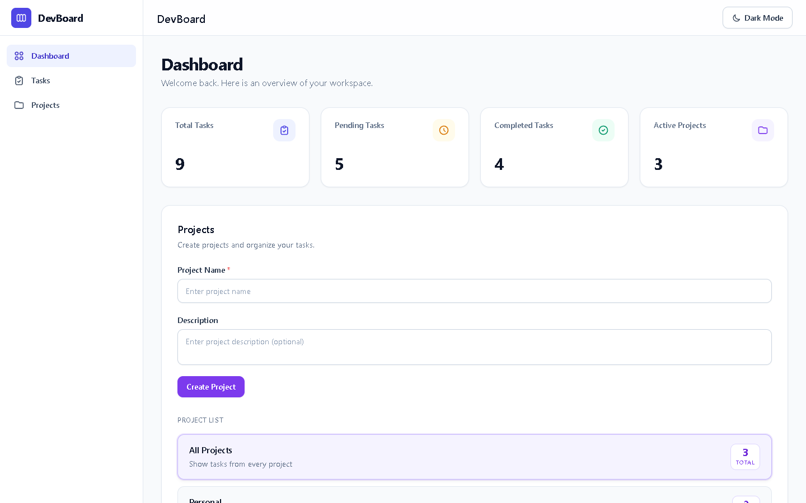
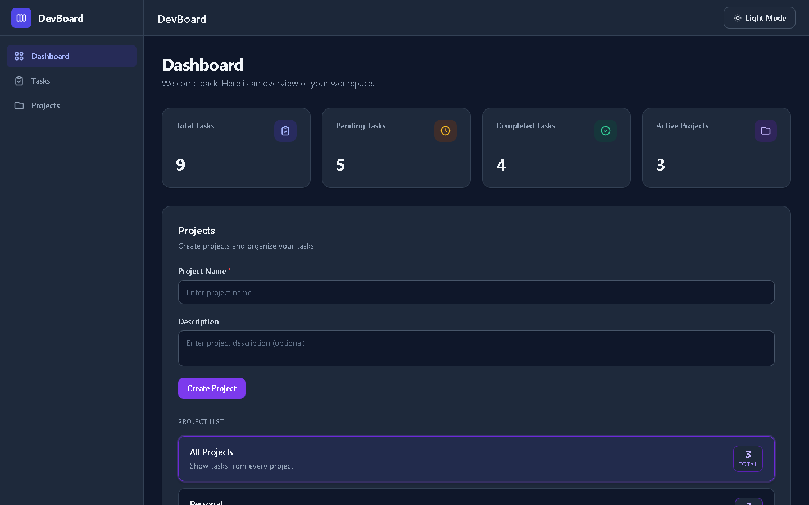
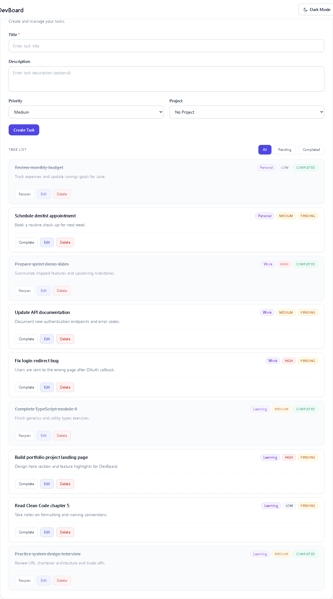
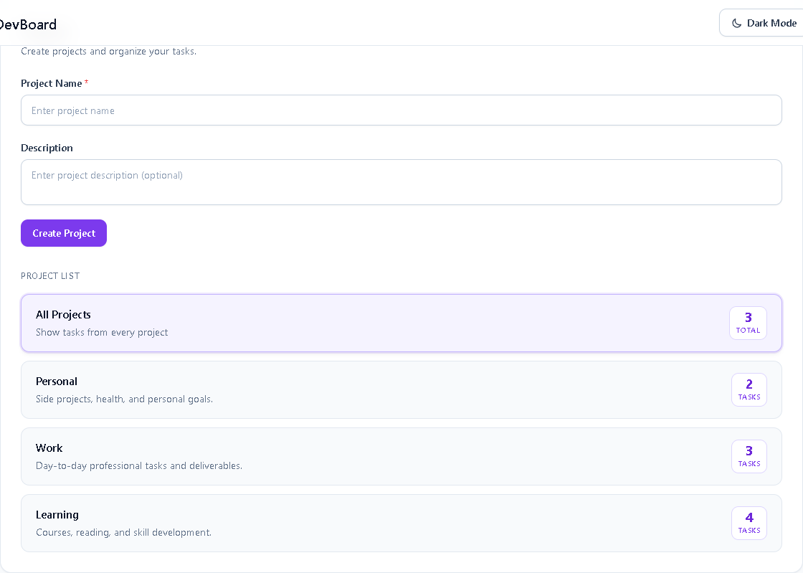

# DevBoard

A modern productivity dashboard built with **HTML5**, **CSS3**, **Vanilla JavaScript**, and **Tailwind CSS**.

## Overview

DevBoard helps developers manage tasks, projects, and workflow in a clean, responsive SaaS-style interface.

## Screenshots

| Dashboard (Light) | Dashboard (Dark) |
| --- | --- |
|  |  |

| Task Management | Project Management |
| --- | --- |
|  |  |

## Tech Stack

- HTML5
- CSS3
- Vanilla JavaScript
- Tailwind CSS (CDN)
- LocalStorage

## Project Structure

```
devboard/
├── index.html
├── src/
│   ├── css/
│   │   └── styles.css
│   └── js/
│       ├── app.js
│       ├── storage.js
│       ├── utils.js
│       ├── tasks.js
│       ├── projects.js
│       └── theme.js
├── docs/
│   └── screenshots/
├── scripts/
│   └── capture-screenshots.mjs
└── README.md
```

## Getting Started

1. Clone or download this repository.
2. Open `index.html` in your browser — no build step required.

## Development Phases

| Phase | Status   | Description                         |
| ----- | -------- | ----------------------------------- |
| 1     | Complete | Dashboard layout with sidebar & stats |
| 2     | Complete | LocalStorage persistence            |
| 3     | Complete | Task creation and rendering           |
| 4     | Complete | Task actions — complete, edit, delete, filters |
| 5     | Complete | Project management and task association |
| 6     | Complete | UI & UX professional polish         |
| 7     | Complete | Dark mode support                   |
| 8     | Complete | Portfolio screenshots               |
| 9     | Complete | Production readiness audit          |

## License

MIT
